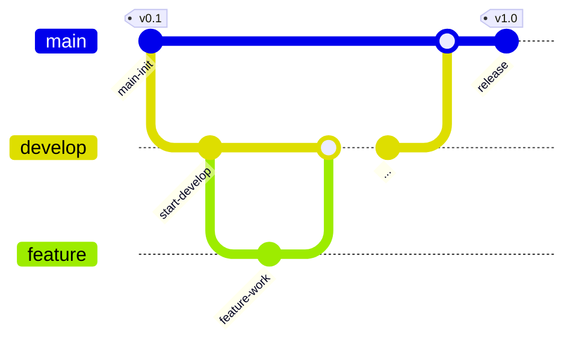

# 키오스콘-iOS

## 프로젝트 소개
**키오스콘**은 키오스크와 팝콘의 합성어로, 팝콘을 판매하는 **영화관 매점 키오스크 UI**를 재현한 **키오스크 앱**입니다.

<div align="center">
    


</div>

<br>

**프로젝트 주제**: 한 페이지 안에 모바일 키오스크 구현하기

**프로젝트 이름**: 키오스콘

**와이어프레임**: 🔗 [피그마](https://www.figma.com/design/q0LcvYBkpQqpy3XFtBgztg/%ED%82%A4%EC%98%A4%EC%8A%A4%EC%BD%98?node-id=0-1&t=2KEaKfFhwVYVpTMn-1)

## 🍎 키오스콘-iOS Team

<br>
<div align="center">

| 신서연   | 변지혜       | 박혜연      |
|-------------|--------------|-------------|
| <div align="center">[@hemssy](https://github.com/hemssy)</div>  | <div align="center">[@munuiee](https://github.com/munuiee)</div> | <div align="center">[@104hyeon](https://github.com/104hyeon)</div> |

</div>
<br>

---
## 실행 화면

---

## Stacks 🐈
### Environment
  

### Development
   

### OS


### Communication
  

### Libraries
[](https://github.com/SnapKit/SnapKit)


<br>

## 📖 Coding Convention

1. 런타임 크래시를 방지하기 위해 강제 언래핑을 사용하지 않는다.
2. 이중 반복문 사용 등 코드가 복잡해지면 주석이나 PR에 설명을 상세하게 써놓는다.
3. 코드에 이모티콘을 추가하지 않는다.


## 🙌 Git Convention

### Git-flow 전략



<br>


1. 작업할 내용에 대해서 이슈를 생성하고 이슈번호를 확인한다.
2. 나의 로컬에서 develop 브랜치가 최신화 되어있는지 확인한다.
3. develop 브랜치에서 새로운 이슈 브랜치를 생성한다.
    
     커밋타입/#이슈번호
     ex) feat/#1
    
4. 생성한 브랜치에서 작업을 시작한다.
5. 작업 완료 후, 에러가 없는지 확인하고 커밋 컨벤션에 맞춰 커밋한 후 push 한다.
6. PR을 작성한다.
7. 코드리뷰 후 수정사항 반영한 뒤, develop 브랜치에 merge 한다.
8. 머지 이후, 작업했던 브랜치는 삭제한다.

<br>

### 커밋타입

> `Feat`: 새로운 기능을 추가할 경우  
>
> 
> `Fix`: 버그를 고친 경우  
>
> 
> `Design`: CSS 등 사용자 UI 디자인 변경  
>
> 
> `Style`: 코드 포맷 변경, 세미 콜론 누락, 코드 수정이 없는 경우  
>
> 
> `Refactor`: 프로덕션 코드 리팩토링  
>
> 
> `Docs`: 문서를 수정한 경우  
>
> 
> `Test`: 테스트 추가, 테스트 리팩토링(프로덕션 코드 변경 X)  
>
> 
> `Chore`: gitignore 파일정리, 빌드 테스트 업데이트, 패키지 매니저를 설정하는 경우(프로덕션 코드 변경 X)  
>
> 
> `Rename`: 파일 혹은 폴더명을 수정하거나 옮기는 작업만인 경우  
>
> 
> `Remove`: 파일을 삭제하는 작업만 수행한 경우  

<br>

### Issue & PR title


**이슈 제목**: `[커밋타입] 작업 이름`

**PR 제목**: `[커밋타입] #이슈번호 - 작업 이름`

<br>

### Commit Message


커밋 메시지는 `[커밋타입] #이슈번호 - 작업 이름` 으로 적는다.

**충돌 해결 merge 시**: `[Merge] develop->브랜치이름 머지`

**PR을 develop에 merge 시** : `[Merge] 브랜치이름->develop 머지`

<br>

## 📂 Foldering
```bash
kioskApp
├── kioskApp
│   ├── 📁 AppDelegate
│   │   ├── AppDelegate.swift
│   │   ├── SceneDelegate.swift
│   │
│   ├── 📁 Models
│   │   ├── MenuItem.swift
│   │
│   ├── 📁 Resources
│   │   ├── Assets
│   │   ├── Info.plist
│   │   ├── LaunchScreen
│   │
│   ├── 📁 ViewController
│   │   ├── 📁 Cell
│   │   │   ├── MenuItemCell.swift
│   │   │   ├── OrderTableViewCell.swift
│   │   │
│   │   ├── 📁 Controller
│   │   │   ├── PaymentPopUpViewController.swift
│   │   │   ├── SplashViewController.swift
│   │   │   ├── MainViewController.swift
│   │   │
│   │   ├── 📁 UIView
│   │       ├── MainCategoryTab.swift
│   │       ├── MainOrderButton.swift
│   │       ├── MenuItemCellDelegate.swift
│   │       ├── PaymentPopUp.swift
